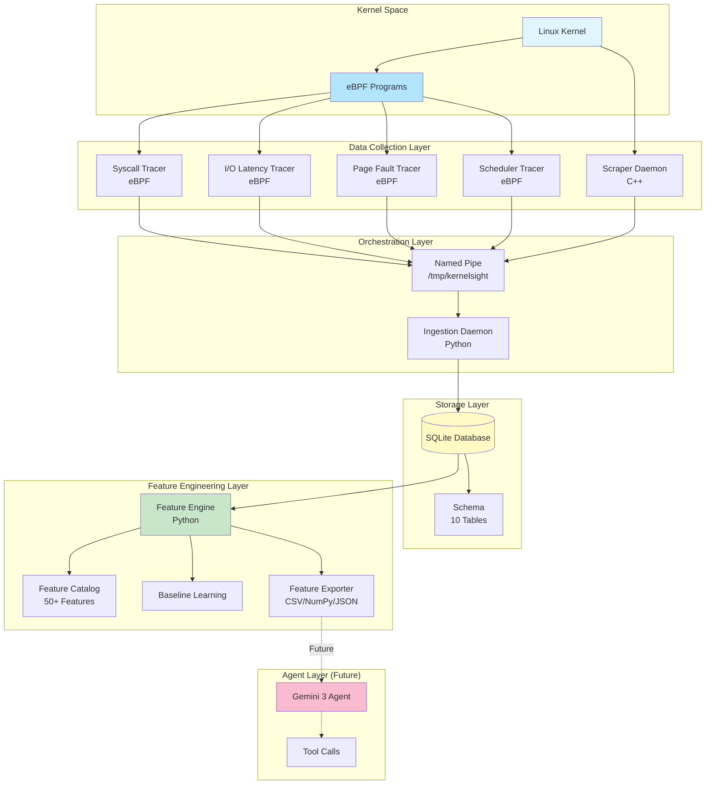
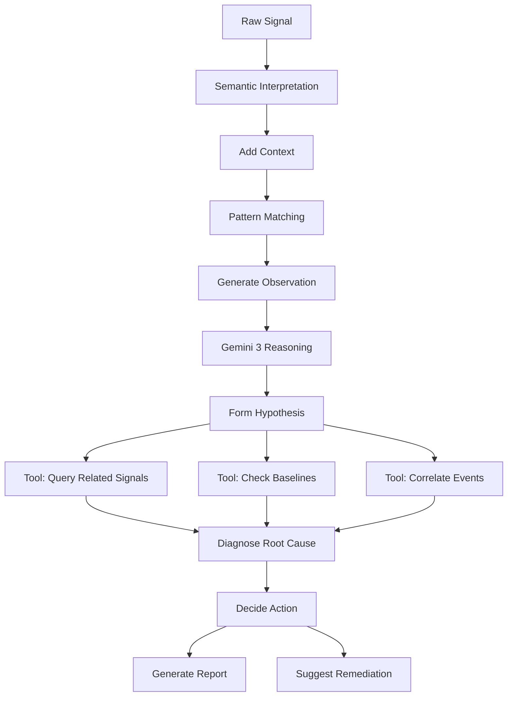
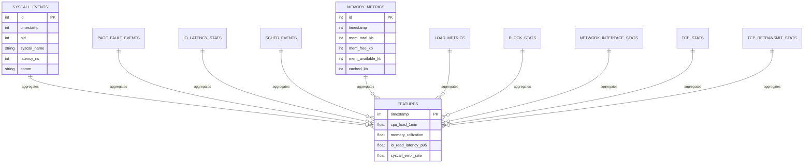
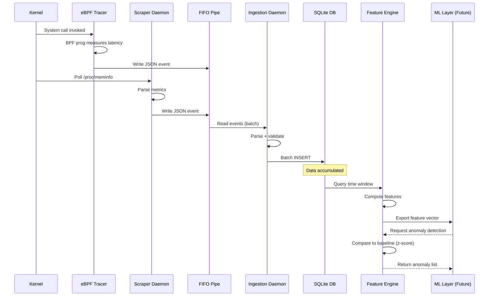
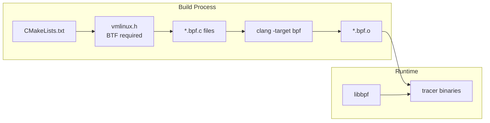
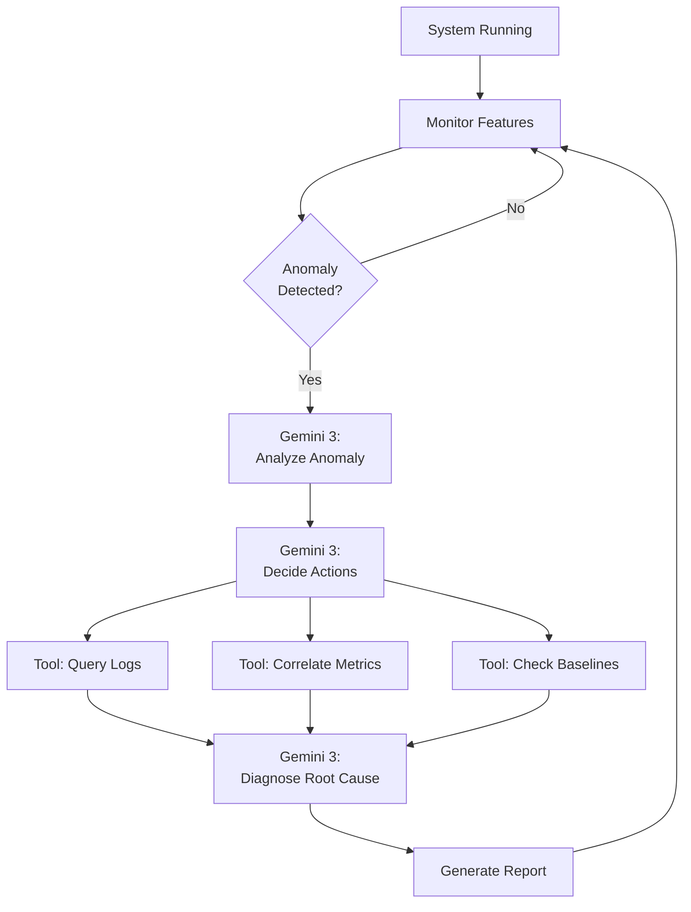

# KernelSight AI - System Architecture

This document provides a comprehensive overview of the KernelSight AI system architecture, detailing the data flow from kernel-level telemetry collection through to machine learning feature engineering.

## High-Level Architecture



---

## Agent Perception Layer: How Gemini 3 Sees the System

> [!IMPORTANT]
> This section defines how KernelSight AI transforms **raw kernel data into semantic signals** that Gemini 3 can reason about. The agent doesn't see metrics—it sees **symptoms, patterns, and behaviors**.

### Perception Philosophy

KernelSight AI is not a monitoring tool that generates alerts. It is an **autonomous perception system** that provides Gemini 3 with:

1. **Context-aware observations** (not metrics)
2. **Semantic meaning** (not numbers)
3. **Behavioral patterns** (not thresholds)
4. **Temporal narratives** (not point-in-time snapshots)

The agent uses these observations to **reason, plan, and act**.

---

### Signal Categories

All signals fall into three categories from the agent's perspective:

| Category | Purpose | Example |
|----------|---------|---------|
| **Symptoms** | Indicators of potential problems | High syscall latency, memory reclaim pressure |
| **Context** | Environmental state for interpretation | Process count, load average, uptime |
| **Baselines** | Learned normal behavior | Expected memory usage, typical syscall rates |

---

### Signal Type Interpretation Guide

#### 1. Syscall Signals → Behavioral Anomalies

**What the Agent Sees**:
- **High-latency syscalls (>10ms)**: Evidence of blocking operations
- **Repeated slow calls**: Systemic degradation, not transient issues
- **Error patterns**: Application or resource failure signatures

**Semantic Interpretation**:

| Pattern | Agent Interpretation | Reasoning Hint |
|---------|---------------------|----------------|
| Frequent `read()` >100ms | **I/O Bottleneck** | Storage subsystem saturated or failing |
| `futex()` latency spikes | **Lock Contention** | Multiple processes competing for resources |
| `epoll_wait()` timeouts | **Event Loop Starvation** | Application not responsive to I/O events |
| High `openat()` error rate | **File System Issue** | Missing files, permissions, or quota exceeded |

**Agent Reasoning Example**:
```
Observation: "syscall_latency_read_avg" increased from 2ms to 150ms over 5 minutes
Interpretation: "I/O subsystem has become severely degraded"
Evidence: p95 latency > 200ms, affecting 80% of read operations
Context: No corresponding CPU or memory pressure
Hypothesis: Disk hardware failure or I/O scheduler misconfiguration
Next Action: Query block device stats, check I/O queue depth
```

---

#### 2. Scheduler Signals → System Fairness & Contention

**What the Agent Sees**:
- **Context switch rates**: CPU scheduling churn
- **Runqueue imbalance**: Uneven CPU load distribution
- **Voluntary vs involuntary switches**: Cooperation vs preemption

**Semantic Interpretation**:

| Pattern | Agent Interpretation | Reasoning Hint |
|---------|---------------------|----------------|
| Context switches >50k/sec | **Scheduling Thrash** | Too many short-lived tasks competing for CPU |
| High involuntary switches | **CPU Starvation** | Processes forcibly preempted, not yielding |
| Runqueue depth >10 | **CPU Saturation** | More work than cores available |
| Wakeup rate >> switch rate | **Serialization Bottleneck** | Tasks waking but not running (blocked on locks) |

**Agent Reasoning Example**:
```
Observation: "Context switches spiked to 75k/sec, 90% involuntary"
Interpretation: "System experiencing severe CPU contention"
Evidence: Runqueue depth averaging 15 processes per core
Context: Load average 8.0 on 4-core system
Hypothesis: Runaway process or fork bomb
Next Action: Identify top context switchers, check for process explosion
```

---

#### 3. Memory Signals → Pressure & Reclaim Activity

**What the Agent Sees**:
- **Memory available**: How much headroom exists
- **Reclaim pressure**: System struggling to free memory
- **Swap activity**: Memory overflow to disk
- **Page fault rates**: Memory access patterns

**Semantic Interpretation**:

| Pattern | Agent Interpretation | Reasoning Hint |
|---------|---------------------|----------------|
| Available < 10% of total | **Memory Pressure** | System approaching OOM (out-of-memory) |
| Dirty pages crescending | **Write Buffer Saturation** | I/O subsystem can't flush fast enough |
| Swap usage increasing | **Memory Overflow** | Active working set exceeds physical RAM |
| Major page faults spiking | **Disk Thrashing** | Pages evicted then immediately needed again |

**Agent Reasoning Example**:
```
Observation: "Memory available dropped from 2GB to 200MB in 10 minutes"
Interpretation: "Application memory leak or workload spike"
Evidence: Dirty pages stable, no swap usage yet
Context: Recent deployment 12 minutes ago
Hypothesis: New code has memory leak
Next Action: Identify process with highest memory growth rate
```

---

#### 4. I/O Signals → Storage Bottlenecks

**What the Agent Sees**:
- **Latency percentiles**: Distribution of I/O wait times
- **Queue depth**: How many operations are waiting
- **IOPS trends**: Operation throughput over time

**Semantic Interpretation**:

| Pattern | Agent Interpretation | Reasoning Hint |
|---------|---------------------|----------------|
| p95 > 10ms, p99 > 100ms | **I/O Tail Latency** | Occasional very slow operations (disk seeks) |
| p50 > 10ms | **I/O Saturation** | Consistent slowness, not just outliers |
| Queue depth >32 | **I/O Queue Congestion** | Requests piling up faster than completion |
| Read latency >> write latency | **Read Amplification** | Cache misses or random access pattern |

**Agent Reasoning Example**:
```
Observation: "Read p95 latency increased from 5ms to 45ms"
Interpretation: "Storage subsystem degradation"
Evidence: Queue depth rising from 4 to 20
Context: Write latency unchanged
Hypothesis: Random read workload overwhelming disk cache
Next Action: Check read/write ratio, analyze access patterns
```

---

#### 5. Network Signals → Connectivity & Congestion

**What the Agent Sees**:
- **TCP connection states**: Health of network connections
- **Error/drop rates**: Packet loss indicators
- **Retransmission rates**: Network quality degradation

**Semantic Interpretation**:

| Pattern | Agent Interpretation | Reasoning Hint |
|---------|---------------------|----------------|
| TIME_WAIT connections >1000 | **Connection Churning** | Rapid connection open/close cycle |
| Retransmit rate >1% | **Network Degradation** | Packet loss, congestion, or routing issues |
| SYN_RECV accumulating | **SYN Flood Attack** | Malicious or legitimate connection storm |
| Errors/drops increasing | **Network Hardware Issue** | Bad cable, switch, or NIC firmware |

**Agent Reasoning Example**:
```
Observation: "TCP TIME_WAIT connections grew from 100 to 2500 in 5 minutes"
Interpretation: "Application not reusing connections properly"
Evidence: ESTABLISHED connections remain low (~50)
Context: No increase in network throughput
Hypothesis: Connection pool misconfiguration or missing HTTP keep-alive
Next Action: Identify process creating connections, check connection reuse
```

---

#### 6. Load Signals → System Capacity

**What the Agent Sees**:
- **Load average vs core count**: Demand vs capacity ratio
- **Process count trends**: Task explosion or normal variance
- **Running vs total processes**: Actual utilization

**Semantic Interpretation**:

| Pattern | Agent Interpretation | Reasoning Hint |
|---------|---------------------|----------------|
| Load > 2× cores | **Oversubscription** | More demand than cores can handle |
| Process count doubling | **Process Explosion** | Fork bomb or runaway spawning |
| Load low but latency high | **I/O Wait Dominates** | Processes blocked on I/O, not CPU-bound |
| Load increasing linearly | **Steady Demand Growth** | Workload scaling up (normal or leak) |

**Agent Reasoning Example**:
```
Observation: "Load average 12.0 on 4-core system, but CPU idle 60%"
Interpretation: "Processes blocked on I/O, not CPU-bound"
Evidence: High I/O wait time, runqueue depth low
Context: Disk latency p95 > 100ms
Hypothesis: Slow storage causing processes to block
Next Action: Check disk saturation, identify I/O-bound processes
```

---

### Observation Schema for Gemini 3

The agent receives observations in this structured format:

```json
{
  "timestamp": 1704470400,
  "observation_type": "symptom",
  "severity": "high",
  "signal_category": "memory",
  "summary": "Memory pressure elevated for 12 minutes",
  "details": {
    "metric": "memory_available_pct",
    "current_value": 8.5,
    "baseline_mean": 45.2,
    "zscore": -4.2,
    "trend": "declining",
    "duration_seconds": 720,
    "first_seen": 1704469680
  },
  "context": {
    "recent_changes": ["deployment_event at T-15min"],
    "correlated_signals": [
      "page_fault_rate increasing",
      "swap_usage starting"
    ]
  },
  "reasoning_hints": [
    "Check for memory leak in recently deployed code",
    "Identify process with highest memory growth",
    "Compare current memory usage to pre-deployment baseline"
  ]
}
```

**Key Fields**:
- **summary**: Natural language explanation (what Gemini sees first)
- **details**: Quantitative evidence
- **context**: Related events and signals
- **reasoning_hints**: Suggested investigation paths

---

### Agent Reasoning Process



**Example Reasoning Flow**:

1. **Signal**: `syscall_read_latency_p95 = 150ms` (normally 3ms)
2. **Interpret**: "I/O operations severely degraded"
3. **Context**: Deployment happened 10 minutes ago
4. **Pattern**: "Post-deployment performance regression"
5. **Observation**: "Read latency increased 50× after deployment"
6. **Gemini Reasoning**:
   - Hypothesis: New code introduced I/O inefficiency
   - Tool Call: `query_syscall_patterns(since=deployment_time)`
   - Find: New code calls `fsync()` on every write
   - Diagnosis: Excessive disk synchronization
   - Action: Recommend batching writes or async I/O

---

### Temporal Persistence Tracking

The agent tracks **how long** abnormal states persist:

| Duration | Interpretation | Agent Response |
|----------|----------------|----------------|
| <1 minute | **Transient** | Log but don't alert |
| 1-5 minutes | **Short-lived issue** | Monitor for recurrence |
| 5-15 minutes | **Persistent problem** | Investigate actively |
| >15 minutes | **Systemic issue** | Urgent attention required |

**Example**:
```
"Memory pressure has been elevated for 18 minutes (persistent systemic issue)"
vs
"Memory pressure spiked briefly for 45 seconds (transient, likely garbage collection)"
```

This temporal context helps Gemini distinguish between normal variance and real problems.

---

### Multi-Signal Correlation

Gemini 3 reasons over **combinations** of signals:

**Example Correlation Pattern**:
```
IF memory_pressure_high 
   AND page_fault_rate_increasing 
   AND swap_usage_starting
THEN "System approaching OOM condition"
     "Predicted failure in 5-10 minutes"
     "Urgent action: identify memory hog"
```

**Another Example**:
```
IF cpu_load_normal
   AND io_latency_high
   AND context_switch_rate_high
THEN "I/O bottleneck causing scheduling churn"
     "Processes blocked on slow I/O"
     "Check disk saturation"
```

---

### Baseline-Aware Interpretation

All observations are contextualized against **learned baselines**:

```
Current: syscall_error_rate = 5 per second
Baseline: mean=0.2, std=0.5
Z-score: +9.6

Interpretation: "Syscall error rate is 9.6 standard deviations above normal"
Narrative: "Sudden surge in syscall failures (5/sec vs typical 0.2/sec)"
Severity: CRITICAL
```

Without baseline: "5 errors/sec" → Is that good or bad?  
With baseline: "9.6σ above normal" → Clearly abnormal!

---

## Component Details


### 1. Data Collection Layer

The data collection layer consists of specialized tracers that gather real-time telemetry from the Linux kernel.

#### eBPF Tracers (C + libbpf)

| Tracer | Purpose | Events Captured |
|--------|---------|-----------------|
| [syscall_tracer](file:///c:/KernelSight%20AI/src/telemetry/ebpf/syscall_tracer.c) | System call monitoring | PID, syscall name, latency, return value, arg0 |
| [io_latency_tracer](file:///c:/KernelSight%20AI/src/telemetry/ebpf/io_latency_tracer.c) | Block I/O performance | Read/write counts, bytes, latency percentiles (p50/p95/p99) |
| [page_fault_tracer](file:///c:/KernelSight%20AI/src/telemetry/ebpf/page_fault_tracer.c) | Memory access patterns | Fault type, address, latency, access type |
| [sched_tracer](file:///c:/KernelSight%20AI/src/telemetry/ebpf/sched_tracer.c) | CPU scheduler activity | Context switches, timeslices, wakeups |

**Technology**: C, libbpf, BPF CO-RE (Compile Once - Run Everywhere)

**Key Features**:
- Zero-copy data transfer via BPF ring buffers
- Sub-microsecond overhead
- Dynamic kernel instrumentation without kernel modules

#### Scraper Daemon (C++)

[scraper_daemon](file:///c:/KernelSight%20AI/src/telemetry/scraper_daemon.cpp) collects system-level metrics from `/proc` and `/sys`:

| Collector | Data Source | Metrics |
|-----------|-------------|---------|
| Memory | `/proc/meminfo` | Total, free, available, cached, buffers, swap |
| Load | `/proc/loadavg` | 1/5/15min load averages, process counts |
| Block | `/sys/block/*/stat` | I/O operations, sectors, queue times |
| Network | `/proc/net/dev` | RX/TX bytes/packets/errors/drops |
| TCP | `/proc/net/tcp`, `/proc/net/snmp` | Connection states, retransmits |

**Collection Interval**: 1 second (configurable)

---

### 2. Orchestration Layer

#### Named Pipe (FIFO)

All collectors write JSON events to `/tmp/kernelsight` (named pipe), enabling:
- **Decoupling**: Collectors don't directly access the database
- **Backpressure**: Automatic flow control if ingestion is slow
- **Simplicity**: Standard Unix IPC mechanism

#### Ingestion Daemon

[ingestion_daemon.py](file:///c:/KernelSight%20AI/src/pipeline/ingestion_daemon.py) reads from the FIFO and batch-inserts events into SQLite:

- **Batch Processing**: Configurable batch size (default: 100 events)
- **Event Routing**: Routes events to appropriate tables based on `event_type` field
- **Error Handling**: Validates JSON, logs malformed events
- **Performance**: Achieves 10,000+ events/sec throughput

---

### 3. Storage Layer

#### Database Schema

[schema.sql](file:///c:/KernelSight%20AI/src/pipeline/schema.sql) defines 10 tables with optimized indexes:



**Indexes**: Each table has indexes on `timestamp` for efficient time-range queries.

**WAL Mode**: Write-Ahead Logging enabled for concurrent read/write access.

---

### 4. Feature Engineering Layer

#### Feature Engine

[feature_engine.py](file:///c:/KernelSight%20AI/src/pipeline/features/feature_engine.py) computes 50+ features from raw telemetry:

**Feature Groups**:

| Group | Examples | Count |
|-------|----------|-------|
| **System Load** | CPU load averages, process counts | 6 |
| **Memory** | Utilization %, cache rate, swap pressure | 12 |
| **Disk I/O** | Read/write IOPS, latency percentiles | 15 |
| **Network** | Throughput, error rates, TCP states | 10 |
| **Syscalls** | Call rate, error rate, top latencies | 8 |
| **Page Faults** | Fault rates by type, average latency | 4 |
| **Derived** | CPU-memory correlation, I/O bottleneck score | 5 |

#### Baseline Learning

The engine supports **baseline mode** to learn normal system behavior:

1. Collect data during normal operation (no anomalies)
2. Compute mean and std for each feature
3. Save baseline statistics to JSON
4. Use for anomaly detection via z-scores

#### Feature Exporter

[exporter.py](file:///c:/KernelSight%20AI/src/pipeline/features/exporter.py) supports multiple formats:

- **CSV**: Human-readable, headers included
- **NumPy (.npz)**: Feature matrix for ML training
- **JSON**: Metadata with statistics for debugging

---

## Data Flow

### End-to-End Pipeline



### Typical Event Timeline

1. **T+0ms**: Kernel event occurs (e.g., system call)
2. **T+0.01ms**: eBPF program records event
3. **T+1ms**: Event written to FIFO as JSON
4. **T+10ms**: Ingestion daemon reads event (batched)
5. **T+100ms**: Batch committed to SQLite
6. **T+1s**: Feature engine queries last 5-minute window
7. **T+1.5s**: Features computed and exported

**Total Latency**: Sub-second from event to feature

---

## Technology Stack

### Core Technologies

| Layer | Technology | Version | Purpose |
|-------|----------|---------|---------|
| **eBPF** | libbpf | Latest | Kernel instrumentation |
| **Build** | CMake | 3.16+ | Cross-platform build system |
| **Collector** | C++17 | GCC 11+ | High-performance scraping |
| **Pipeline** | Python 3.9+ | - | Data processing and ML |
| **Database** | SQLite 3 | WAL mode | Embedded storage |
| **Visualization** | Matplotlib, Seaborn | Latest | EDA and plotting |
| **ML** | NumPy, Pandas | Latest | Feature engineering |

### Build System



**Requirements**:
- Ubuntu 22.04+ LTS or compatible
- Kernel 5.15+ with BTF enabled
- `linux-headers` for vmlinux.h generation

---

## Deployment Architecture

### Target Environment

**Primary**: Ubuntu 22.04 LTS (WSL2 supported)

**Minimum Requirements**:
- Linux kernel 5.15+
- 4GB RAM
- 10GB disk space
- Root privileges for eBPF

### File Structure

```
KernelSight AI/
├── src/
│   ├── telemetry/          # C/C++ collectors
│   │   ├── ebpf/           # BPF programs
│   │   ├── common/         # Shared headers
│   │   └── scraper_daemon.cpp
│   └── pipeline/           # Python processing
│       ├── features/       # Feature engineering
│       ├── ingestion_daemon.py
│       └── db_manager.py
├── build/                  # CMake build output
├── data/                   # Databases and exports
├── logs/                   # Application logs
└── scripts/                # Utilities and tests
```

---

## Future: Gemini 3 Agent Integration

> [!NOTE]
> The agent layer is planned for future implementation.

### Autonomous Reasoning Loop



### Agent Capabilities

1. **Anomaly Detection**: Continuously monitor feature z-scores
2. **Root Cause Analysis**: Correlate metrics across subsystems
3. **Predictive Insights**: Identify trends before failures
4. **Action Planning**: Suggest mitigation strategies
5. **Learning**: Improve baseline models over time

### Tool Interface

The agent will have access to:

- `query_database(sql)`: Raw SQL access
- `get_current_features()`: Latest feature vector
- `compare_baseline(window)`: Anomaly scoring
- `analyze_logs(pattern)`: Log pattern matching
- `export_report(format)`: Generate diagnostics

---

## Key Design Decisions

### Why eBPF?

- **Zero Overhead**: Sub-microsecond event capture
- **Safe**: Kernel verifier ensures no crashes
- **Dynamic**: No kernel recompilation required
- **Portable**: BPF CO-RE runs on any recent kernel

### Why Named Pipe?

- **Decoupling**: Collectors and ingestion are independent processes
- **Resilience**: FIFO buffers events if ingestion is temporarily slow
- **Simplicity**: Standard Unix IPC, no external message queue needed

### Why SQLite?

- **Embedded**: No separate database server
- **ACID**: Full transaction support
- **Performance**: 50,000+ inserts/sec with batching
- **Portability**: Single file, easy to backup/transfer

### Why Batch Ingestion?

- **Performance**: 100x faster than individual inserts
- **Consistency**: All events in batch are atomic
- **Efficiency**: Reduces write amplification to disk

---

## Performance Characteristics

### Throughput

- **eBPF Tracers**: 100,000+ events/sec per tracer
- **Scraper Daemon**: 1 collection/sec (low overhead)
- **Ingestion Daemon**: 10,000+ events/sec sustained
- **Feature Engine**: 60-second window computed in <200ms

### Overhead

- **CPU**: <5% on idle system, <10% under stress
- **Memory**: ~100MB total (all collectors + ingestion)
- **Disk**: ~1MB/min during heavy load
- **Network**: None (local-only pipeline)

### Scalability

Current design targets **single-host** monitoring. For multi-host deployments, consider:
- Central time-series database (InfluxDB, Prometheus)
- Distributed message queue (Kafka)
- Aggregation layer for feature computation

---

## Observability

### Logging

All components log to `logs/`:

- `logs/stress_test/ingestion.log`: Batch stats, errors
- `logs/stress_test/scraper.log`: Collection cycles
- `logs/stress_test/syscall.log`: eBPF tracer output
- `logs/stress_test/io.log`: I/O tracer diagnostics
- `logs/stress_test/pagefault.log`: Page fault events
- `logs/stress_test/sched.log`: Scheduler trace

### Monitoring

Use [explore_data.py](file:///c:/KernelSight%20AI/scripts/explore_data.py) for:
- Database health checks
- Event type coverage
- Log analysis (errors, warnings)
- Performance visualization

---

## References

- [eBPF Documentation](https://ebpf.io/)
- [libbpf GitHub](https://github.com/libbpf/libbpf)
- [SQLite WAL Mode](https://www.sqlite.org/wal.html)
- [Linux /proc Filesystem](https://man7.org/linux/man-pages/man5/proc.5.html)
